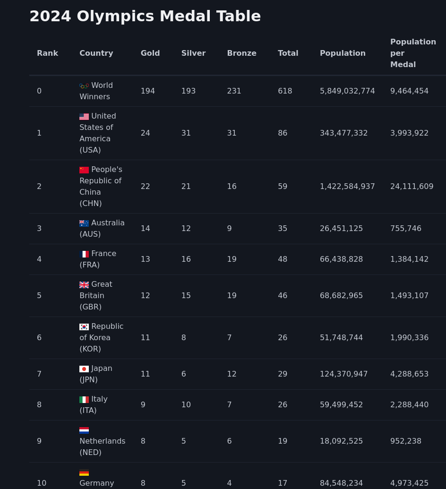

<!-- # 2024 Olympics Medal Table -->


A web app that presents an up-to-date 2024 Olympics Medal Table, with additional data. The motivation for this project was to experiment with FastHTML, Selenium, Pandas, SQLite, etc.

**Note**: Now that the 2024 Olympics are over, the web-app no longer performs automatic updates by default (for obvious reasons). We use the `medals.db` SQLite database file instead.

## How-to build and run web app

```bash
docker build -t olympics . && docker run -p 5001:5001 --shm-size 2g olympics
```
Then Simply navigate to [http://localhost:5001](http://localhost:5001) in your favourite web browser.

## Features

* **Single Page Website**: Generated by FastHTML.
* **Interactive Table**: Vanilla JS provides sorting of table columns. Just click the table header cells you want sorted.
* **Automatic Updates**: Medal Table data is updated in the background every 20-40 minutes (by default). Page refresh is required to view changes.
* **Additional Data**: Includes "World Winners", population and population-per-medal data. "World Winners" represents a country-agnostic total (i.e. all Olympic winning countries).

## Data Sources

* “Medal count - Paris 2024 Olympic Medal table.” https://olympics.com/en/paris-2024/medals
* HYDE (2023); Gapminder (2022); UN WPP (2024) – with major processing by Our World in Data. “Population” [dataset]. PBL Netherlands Environmental Assessment Agency, “History Database of the Global Environment 3.3”; Gapminder, “Population v7”; United Nations, “World Population Prospects”; Gapminder, “Systema Globalis” [original data]. Retrieved August 6, 2024 from https://ourworldindata.org/grapher/population
